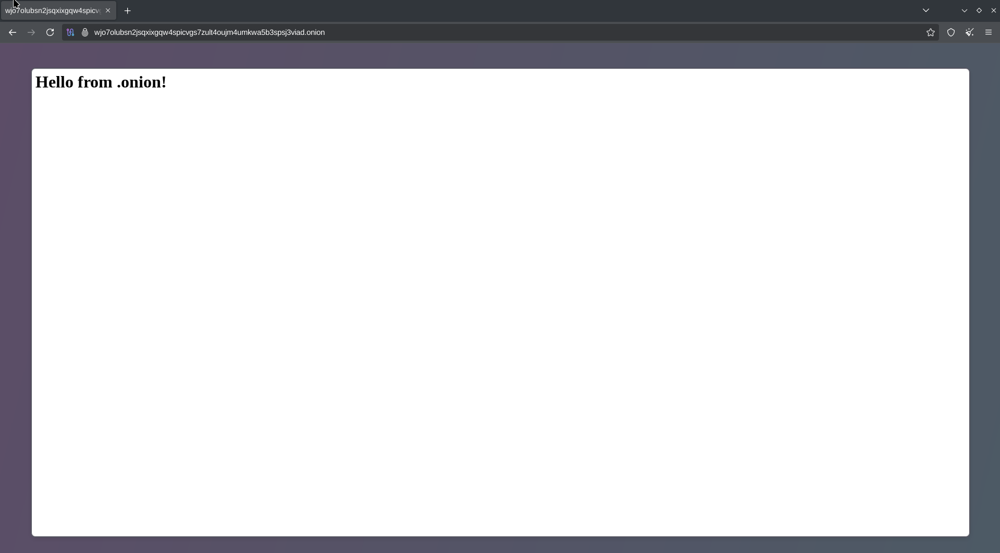

## 🔧 Step-by-Step Setup Tor Hidden Service di EndeavourOS

---

### 1. ✅ **Install Tor**

Jalankan perintah:

```bash
sudo pacman -S tor
```

---

### 2. ✅ **Aktifkan & Jalankan Tor**

Enable agar auto-start saat boot:

```bash
sudo systemctl enable tor
```

Jalankan sekarang:

```bash
sudo systemctl start tor
```

---

### 3. ✅ **Setup Web Server Lokal (Flask)**

Install Python dan Flask:

```bash
sudo pacman -S python python-pip
pip install flask
```

Buat file `app.py`:

```python
from flask import Flask
app = Flask(__name__)

@app.route('/')
def home():
    return "Hello from .onion!"

if __name__ == '__main__':
    app.run(host='127.0.0.1', port=8080)
```

Jalankan:

```bash
python app.py
```

---

### 4. ✅ **Konfigurasi Hidden Service di Tor**

Edit file konfigurasi Tor:

```bash
sudo nano /etc/tor/torrc
```

Tambahkan ini di akhir file:

```bash
HiddenServiceDir /var/lib/tor/hidden_web/
HiddenServicePort 80 127.0.0.1:8080
```

**Simpan dan keluar** (`Ctrl+O`, `Enter`, `Ctrl+X`).

---

### 5. ✅ **Restart Tor**

```bash
sudo systemctl restart tor
```

---

### 6. ✅ **Dapatkan Alamat .onion**

```bash
sudo cat /var/lib/tor/hidden_web/hostname
```

Kamu akan dapat hasil seperti:

```
abcdef1234567890.onion
```

Buka Tor Browser, masukin alamat `.onion` tersebut, dan boom — web kamu bisa diakses via Tor 🎉

---

### 7. ✅ (Opsional) Jika Ada Error Permission:

Kadang direktori `/var/lib/tor/hidden_web/` perlu permission:

```bash
sudo chown -R tor:tor /var/lib/tor/hidden_web/
sudo chmod 700 /var/lib/tor/hidden_web/
```

---

### ✅ Selesai!


Sekarang kamu udah bisa:

* Hosting `.onion` di EndeavourOS,
* Tanpa expose IP asli,
* Tanpa domain berbayar,
* Siap buat infrastruktur stealth Red Teaming.
